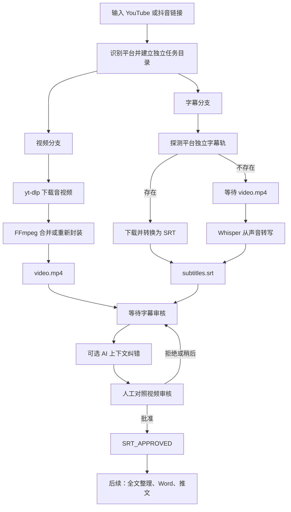

# Video Content Agent

把一条 YouTube 或抖音视频链接，变成一套可以继续编辑、审核和再创作的本地素材：

- 一份标准的 `video.mp4` 视频；
- 一份带时间轴的 `subtitles.srt` 字幕；
- 一份去掉时间轴、方便阅读的 `transcript.txt` 全文；
- 一套可选的 AI 字幕纠错与人工批准流程。

这个项目面向**个人、本地、Windows 优先**的使用场景。它不是一个在线视频网站，也不是简单地把几条下载命令拼在一起；它更像一条可追踪的内容处理流水线：每次收到链接都会建立独立任务目录，同时处理视频和字幕，并把每一步的状态、结果和错误原因记录下来。

> 当前版本已经完成“下载 MP4 → 获取或生成 SRT → AI 辅助纠错 → 人工审核批准”。全文结构化整理、Word 导出、原创推文生成和手机入口属于后续里程碑，详见[项目路线图](#项目路线图)。

## 目录

- [项目能做什么](#项目能做什么)
- [整个流程是怎么工作的](#整个流程是怎么工作的)
- [开始之前](#开始之前)
- [安装与环境检查](#安装与环境检查)
- [5 分钟快速上手](#5-分钟快速上手)
- [下载 YouTube 视频](#下载-youtube-视频)
- [下载抖音视频](#下载抖音视频)
- [字幕审核与 AI 纠错](#字幕审核与-ai-纠错)
- [输出文件说明](#输出文件说明)
- [任务状态说明](#任务状态说明)
- [常见问题与排错](#常见问题与排错)
- [项目结构](#项目结构)
- [测试与开发](#测试与开发)
- [安全与使用边界](#安全与使用边界)
- [项目路线图](#项目路线图)

## 项目能做什么

### 1. 下载并统一保存为 MP4

程序使用 `yt-dlp` 解析 YouTube 或抖音链接，再借助 FFmpeg 合并音视频或重新封装，最终尽量统一为：

```text
video.mp4
```

“重新封装（remux）”不是重新压制画质。大白话说，就是在不重复编码的情况下，把已经下载的音视频流装进 MP4 容器，通常速度更快，也不会因为再次压缩而额外损失画质。

### 2. 优先拿平台字幕，没有就听声音生成

字幕分支会先询问平台：“这条视频有没有可以单独下载的字幕轨？”

- **有独立字幕轨**：下载并转换为标准 SRT；
- **没有独立字幕轨**：等待 MP4 下载完成，再调用本机 Whisper 从声音中转写；
- **画面里有字、接口却说没字幕**：通常是烧录字幕，详见[为什么画面有字幕，程序却说没有字幕](#为什么画面有字幕程序却说没有字幕)。

最终统一输出：

```text
subtitles.srt
```

### 3. 两条分支互不拖累

视频和字幕是两条独立分支。这样设计的好处是：如果字幕提取失败，已经下载好的 MP4 不会被删除；反过来，如果视频下载失败，程序仍会保留已经获取到的字幕和日志。

这种状态叫作 `PARTIAL_FAILURE`，意思是“部分失败”，不是“所有成果都作废”。

### 4. AI 只生成草稿，不覆盖原字幕

Whisper 对人名、地名、年份、数字、同音词和专业术语可能听错。项目可以把整段上下文交给语言模型做辅助校对，但会坚持以下原则：

- 原始 `subtitles.srt` 永远保留；
- AI 结果写入 `subtitles.ai.srt`；
- 每一处修改记录在 `correction-report.md`；
- 没有人工批准，任务不会进入后续内容整理。

### 5. 用真正的审核窗口作决定

项目提供 Windows 图形审核窗口。你可以打开原字幕、AI 草稿、纠错报告和视频，修改并保存后，再选择：

- 稍后处理；
- 拒绝 AI 草稿；
- 批准并进入下一步。

批准后会生成：

```text
subtitles.approved.srt
transcript.approved.txt
```

## 整个流程是怎么工作的



这里最重要的不是某一个下载命令，而是**任务状态和文件可追踪**。每个任务都有自己的 `manifest.json`，以后接入网页、机器人或任务队列时，不需要推倒重来。

## 开始之前

### 适用环境

当前版本优先支持：

- Windows 10 或 Windows 11；
- Windows PowerShell 5.1 或 PowerShell 7；
- Python 3.11；
- 能够正常访问目标视频页面的网络环境；
- 足够保存视频和 Whisper 模型的磁盘空间。

项目自身要求 Python `>=3.11`。Whisper 官方文档目前主要说明兼容 Python 3.8–3.11；较新的 Python 版本可能也能运行，但遇到 PyTorch、`tiktoken` 或模型依赖问题时，建议优先换用 Python 3.11，而不是反复修补环境。

### 依赖工具分别负责什么

| 工具 | 作用 | 大白话解释 |
| --- | --- | --- |
| Python | 运行项目主程序 | 整条流水线的“总调度员” |
| `yt-dlp` | 解析链接并下载媒体/字幕 | 负责和 YouTube、抖音页面打交道 |
| FFmpeg / ffprobe | 合并、封装、读取媒体 | 把音轨和画面整理成可播放的 MP4 |
| OpenAI Whisper | 自动语音识别（ASR） | 平台没字幕时，直接“听”视频说了什么 |
| OpenAI API（可选） | 上下文字幕纠错 | 帮忙修正明显错字，但不能代替人工核对 |

## 安装与环境检查

### 第一步：取得项目

已经下载本项目的用户可以跳过本节。首次使用时，在 PowerShell 中执行：

```powershell
git clone "https://github.com/kohkahhong/Youtube-link-transforming-to-.mp4-and-.srt.git"
cd "Youtube-link-transforming-to-.mp4-and-.srt"
```

### 第二步：安装 Python 依赖

建议在 Python 3.11 环境中执行：

```powershell
py -3.11 -m pip install --upgrade pip
py -3.11 -m pip install -U "yt-dlp[default]" openai-whisper
py -3.11 -m pip install -e .
```

如果电脑只有一个 Python，也可以把 `py -3.11` 改成 `py`。

`yt-dlp` 官方支持通过发布版程序、`pip` 或第三方包管理器安装；Whisper 官方推荐通过 `pip install -U openai-whisper` 安装。抖音、YouTube 等网站经常更新接口，下载突然失效时，应先升级 `yt-dlp`：

```powershell
py -m pip install -U "yt-dlp[default]"
```

### 第三步：安装 FFmpeg

Whisper 和 `yt-dlp` 都需要真正的 FFmpeg 命令行程序。请注意：这里需要的是 **FFmpeg 可执行程序**，不是名字相似的 Python 包。

Windows 可使用 Chocolatey 或 Scoop：

```powershell
choco install ffmpeg
```

或者：

```powershell
scoop install ffmpeg
```

### 第四步：逐项检查

安装后关闭并重新打开 PowerShell，执行：

```powershell
py --version
yt-dlp --version
ffmpeg -version
py -m whisper --help
```

四条命令都能返回版本或帮助内容，才说明基础环境已经准备好。若提示“无法识别命令”，通常是软件未安装、安装到了另一个 Python，或程序目录尚未加入 `PATH`。

## 5 分钟快速上手

### 1. 进入项目目录

```powershell
cd "你的项目目录\Youtube-link-transforming-to-.mp4-and-.srt"
```

### 2. 提交一个链接

```powershell
powershell -NoProfile -ExecutionPolicy Bypass -File ".\run.ps1" `
  -Url "YOUTUBE_OR_DOUYIN_URL" `
  -Language "zh"
```

### 3. 等待任务结束

程序会打印一个类似下面的任务编号：

```text
20260815-163627-68ed99
```

文件位于：

```text
jobs\20260815-163627-68ed99\
```

### 4. 打开审核窗口

把下面的示例编号替换成你自己的任务编号：

```powershell
powershell -NoProfile -ExecutionPolicy Bypass -File ".\review.ps1" `
  -JobDir "20260815-163627-68ed99" `
  -Interactive
```

### 5. 批准字幕

在窗口中依次播放视频、打开审核字幕、保存修改，然后点击“批准并进入下一步”。检查最终文件：

```powershell
Test-Path ".\jobs\20260815-163627-68ed99\subtitles.approved.srt"
```

返回 `True` 就代表批准文件已经生成。

## 下载 YouTube 视频

普通公开链接通常不需要浏览器 Cookie：

```powershell
.\run.ps1 `
  -Url "https://youtu.be/VIDEO_ID" `
  -Language "zh" `
  -WhisperModel "base"
```

如果 YouTube 明确返回：

```text
has no automatic captions
has no subtitles
```

意思只是平台没有提供独立字幕，不是视频下载失败。只要 `video.mp4` 成功生成，程序就会自动转入 Whisper 语音识别。

## 下载抖音视频

抖音经常要求新鲜 Cookie，即使账号没有登录也可能需要浏览器刚刚通过验证后生成的会话信息。推荐使用专门的 Firefox 会话：

1. 用 Firefox 打开抖音短链接；
2. 等视频能够正常播放；
3. 如果出现验证，先手动完成；
4. 关闭**全部** Firefox 窗口；
5. 在任务管理器中确认没有 `firefox.exe`；
6. 运行：

```powershell
.\run.ps1 `
  -Url "https://v.douyin.com/你的短链接/" `
  -Language "zh" `
  -WhisperModel "base" `
  -CookiesFromBrowser "firefox"
```

为什么要关闭整个浏览器，而不只是抖音标签页？因为浏览器还开着时，Cookie 数据库可能正在被占用，`yt-dlp` 无法安全复制或读取它。

### Chrome 和 Edge 为什么更容易失败

Windows 上的 Chrome/Edge 可能因为进程锁定或 Chromium 的 DPAPI/App-Bound 加密机制而无法解密 Cookie。常见报错包括：

```text
Could not copy Chrome cookie database
Failed to decrypt with DPAPI
```

遇到这种情况时，不建议反复关闭 GitHub 等重要标签页。最省事的做法是：保留日常 Chrome，单独使用 Firefox 打开抖音，并把 Firefox 作为下载专用浏览器。

## 字幕审核与 AI 纠错

### 只生成纯文本和审核说明

```powershell
.\review.ps1 -JobDir "你的任务编号"
```

输出：

```text
transcript.txt
subtitle-review.md
```

### 使用 AI 生成纠错草稿

```powershell
.\review.ps1 `
  -JobDir "你的任务编号" `
  -UseAI `
  -Context "视频主题、人物、地点、专业词语"
```

`-Context` 很重要。比如视频讲河南台风暴雨，可以写：

```text
河南、台风暴雨、气象地理、太行山、伏牛山、水汽输送
```

上下文越准确，AI 越容易识别人名、地名和专业词，但它仍可能改错数字或专有名词。因此项目会生成：

```text
subtitles.ai.srt       AI 待审核字幕
transcript.ai.txt      AI 待审核全文
correction-report.md   每一处修改及理由
```

如果当前 PowerShell 没有 `OPENAI_API_KEY`，脚本会使用隐藏输入框临时读取密钥。密钥只放在当前进程环境中，流程结束后清除，不会写入任务目录。

### 打开 Windows 人工审核窗口

```powershell
.\review.ps1 -JobDir "你的任务编号" -Interactive
```

推荐审核顺序：

1. 点击“播放视频”；
2. 点击“打开审核字幕”；
3. 重点核对人名、地名、年份、数字、单位和专业词；
4. 在记事本中直接修改，按 `Ctrl + S` 保存；
5. 查看 `correction-report.md`，检查 AI 改动；
6. 返回窗口，点击“批准并进入下一步”。

如果窗口没有弹出，可直接运行：

```powershell
powershell -NoProfile -ExecutionPolicy Bypass -Sta `
  -File ".\review-window.ps1" `
  -JobDir ".\jobs\你的任务编号"
```

若当前 Python 的 Tk 图形组件完整，也可以使用高级逐条对比编辑器：

```powershell
py -m video_agent.review_gui --job-dir "jobs\你的任务编号"
```

### 直接在命令行批准

已经人工检查并保存 AI 草稿后，可以执行：

```powershell
.\review.ps1 `
  -JobDir "你的任务编号" `
  -InputSrt "subtitles.ai.srt" `
  -Approve
```

批准会生成：

```text
subtitles.approved.srt
transcript.approved.txt
```

任务状态变为 `SRT_APPROVED`。

### 新任务完成后自动打开审核窗口

```powershell
.\run.ps1 `
  -Url "URL" `
  -Language "zh" `
  -CookiesFromBrowser "firefox" `
  -OpenReviewWindow
```

这个窗口是项目自己的“内容审核界面”。Codex 的系统批准框主要用于沙箱、网络权限和外部副作用审批，普通 PowerShell 脚本不能把它当作字幕审核弹窗使用。

## 输出文件说明

每个任务位于 `jobs/<任务编号>/`，不同任务不会互相覆盖。

| 文件 | 用途 | 是否建议手动修改 |
| --- | --- | --- |
| `video.mp4` | 最终 MP4 视频 | 否 |
| `subtitles.srt` | 平台字幕或 Whisper 原始字幕 | 建议保留原样 |
| `transcript.txt` | 去掉时间轴的原始全文 | 可以复制阅读 |
| `subtitle-review.md` | 审核提示 | 否 |
| `subtitles.ai.srt` | AI 纠错草稿 | 可以，审核时修改它 |
| `transcript.ai.txt` | AI 草稿对应全文 | 一般由程序生成 |
| `correction-report.md` | AI 改动清单 | 用于核对 |
| `subtitles.approved.srt` | 人工批准的最终字幕 | 后续流程以它为准 |
| `transcript.approved.txt` | 人工批准的最终全文 | 后续整理的输入 |
| `manifest.json` | 机器可读的任务状态 | 不建议手改 |
| `video.log` | 视频下载诊断日志 | 出错时查看 |
| `subtitles.log` | 字幕探测/转写诊断日志 | 它不是字幕成品 |

### SRT 是什么

SRT 是最常见的外挂字幕格式之一。每一条字幕包含编号、开始时间、结束时间和文字，例如：

```srt
1
00:00:00,000 --> 00:00:03,200
为什么河南不靠海，却经常受到台风暴雨影响？
```

它可以被剪辑软件、播放器和后续自动化程序读取。文件扩展名是 `.srt`，不是 `.crt`。

## 任务状态说明

`manifest.json` 记录任务当前走到哪里。常见状态如下：

| 状态 | 含义 | 下一步 |
| --- | --- | --- |
| `RECEIVED` | 已收到链接 | 等待处理 |
| `PROCESSING_MEDIA` | 正在处理视频与平台字幕 | 保持窗口运行 |
| `TRANSCRIBING_WITH_WHISPER` | 没有平台字幕，正在听写 | 等待 CPU/GPU 完成 |
| `WAITING_SUBTITLE_REVIEW` | 原始字幕准备好 | 打开审核流程 |
| `WAITING_AI_SUBTITLE_REVIEW` | AI 草稿准备好 | 人工核对并决定 |
| `SRT_APPROVED` | 字幕已人工批准 | 可以进入全文整理 |
| `PARTIAL_FAILURE` | 至少一个分支失败 | 查看成功文件和日志 |

## 常见问题与排错

### 为什么画面有字幕，程序却说没有字幕

画面底部的文字可能已经直接绘制进视频像素，这叫作**烧录字幕、硬字幕或内嵌字幕**。它看起来像字幕，但平台并没有提供单独的字幕文件。

`yt-dlp` 能提取的是平台接口暴露的独立字幕轨，不能直接把画面像素变成 SRT。因此程序会退回到 Whisper，从声音转写文字。这是正常流程，不代表程序没有看见视频。

若以后加入视觉 OCR，可以把画面文字和 Whisper 结果相互校验；当前版本没有默认启用 OCR。

### `FP16 is not supported on CPU; using FP32 instead` 是错误吗

不是错误。它表示 Whisper 没有使用支持 FP16 的显卡加速，自动改用 CPU 的 FP32 计算。

- 结果仍然可以正常生成；
- 速度会比合适的 GPU 慢；
- 不需要因为这条警告停止任务。

### Whisper 为什么有些词听不准

ASR（自动语音识别）会受到口音、背景音乐、多人重叠说话、音量、语速和专业术语影响。建议按以下顺序提高质量：

1. 明确指定 `-Language "zh"`；
2. 从 `base` 升到 `small`；
3. 给 AI 纠错提供准确的 `-Context`；
4. 对照视频人工核对关键事实；
5. 对特别重要的字幕，优先核对数字、日期、姓名和地名。

`small` 通常比 `base` 更准确，但在 CPU 上会明显更慢：

```powershell
.\run.ps1 -Url "URL" -Language "zh" -WhisperModel "small"
```

### 为什么 TXT 是乱码，但 SRT 正常

这通常不是字幕内容损坏，而是文本编辑器把 UTF-8 误判成 GBK/ANSI。

当前项目使用 UTF-8，并为需要直接阅读的文本写入 BOM，以提高旧版 Windows 记事本的识别率。遇到旧文件乱码时，可在 VS Code 或新版记事本中用 UTF-8 打开并另存。

请注意区分：

- `transcript.txt`：可阅读的字幕全文；
- `subtitles.log`：程序诊断日志，不是字幕正文。

### `Fresh cookies are needed` 怎么办

这表示抖音拒绝了没有有效会话信息的请求。用 Firefox 正常播放一次链接、完成验证、彻底退出 Firefox，再加上：

```powershell
-CookiesFromBrowser "firefox"
```

### `Could not copy ... cookie database` 怎么办

只关闭抖音标签页不够。需要关闭该浏览器的所有窗口，并确认任务管理器中对应进程已经退出。如果不想关闭日常 Chrome，使用专门的 Firefox 会话。

### `Failed to decrypt with DPAPI` 怎么办

这是 Chromium Cookie 在 Windows 上的解密限制。优先改用 Firefox，不要为了绕过它复制或上传整个浏览器配置目录。

### `Model has been downloaded but the SHA256 checksum does not match` 怎么办

模型文件可能下载不完整或被代理缓存替换。不要删除整个缓存目录。先查看 Whisper 实际使用的模型缓存位置，只删除报错指向的那个明确 `.pt` 文件，再重新下载。若 `Test-Path` 返回 `False`，说明模型不在你检查的路径，应根据报错和当前 Python 环境继续定位，而不是盲删其他文件。

### `PARTIAL_FAILURE` 到底算成功还是失败

它表示“任务没有百分之百完成”。打开 `manifest.json` 查看两个分支：

- `branches.video.status`；
- `branches.subtitles.status`。

如果视频是 `READY`、字幕是 `FAILED`，MP4 仍然可以使用；修复字幕问题后再单独处理，不需要删除成功视频。

## 项目结构

```text
video-content-agent/
├─ run.ps1                     # 一键启动媒体处理
├─ review.ps1                  # 字幕产物、AI 纠错与审核入口
├─ review-window.ps1           # Windows 原生审核窗口
├─ pyproject.toml              # Python 项目元数据与命令入口
├─ IMPLEMENTATION_PLAN.md      # 后续里程碑计划
├─ video_agent/
│  ├─ cli.py                   # 命令行参数与任务入口
│  ├─ pipeline.py              # 下载、字幕探测、Whisper 回退与状态管理
│  ├─ subtitles.py             # SRT 解析、编码、AI 纠错与报告
│  ├─ review_cli.py            # 审核命令行流程
│  └─ review_gui.py            # 高级逐条字幕审核界面
├─ tests/
│  └─ test_pipeline.py         # 单元测试
└─ jobs/                       # 本地任务结果；已被 Git 忽略
```

`jobs/` 不会上传到 GitHub，因为里面可能含有视频、字幕、Cookie 快照、日志和个人处理记录。

## 测试与开发

运行单元测试：

```powershell
py -m unittest discover -s tests -v
```

只检查 Windows 审核窗口的数据，不真正弹窗：

```powershell
powershell -NoProfile -ExecutionPolicy Bypass -File ".\review-window.ps1" `
  -JobDir ".\jobs\你的任务编号" `
  -CheckOnly
```

设计上的几个关键约束：

- 不因为一条分支失败而删除另一条分支的成果；
- 不用 AI 草稿覆盖原始字幕；
- 不在没有人工批准时进入内容再创作；
- 不把 Cookie、API 密钥和任务媒体提交进 Git；
- 用 `manifest.json` 保存可恢复、可扩展的任务状态。

## 安全与使用边界

- 仅处理你有权访问、下载和使用的内容，并遵守来源平台条款及适用规则；
- 浏览器 Cookie 等同于会话凭据，不要上传、提交或发给他人；
- 不要把 OpenAI API 密钥写入脚本、README、任务目录或 Git 历史；
- AI 纠错不能保证事实正确，发布前仍需人工核对；
- 当前仓库主要用于个人自动化实验，不承诺平台接口长期稳定。

本仓库当前没有单独声明开源许可证。仓库公开可见不等于自动授予复制、修改或再分发许可；如需开放协作，应补充明确的 `LICENSE`。

## 项目路线图

### 已完成：本地媒体与字幕主流程

- [x] 识别 YouTube、`youtu.be`、抖音和抖音短链接；
- [x] 为每条链接建立独立任务目录；
- [x] 并行处理 MP4 与字幕分支；
- [x] 优先平台字幕，无字幕时调用 Whisper；
- [x] 输出 UTF-8 SRT 与纯文本；
- [x] 支持 Firefox Cookie 快照；
- [x] 保留日志和部分成功结果；
- [x] AI 上下文纠错草稿与纠错报告；
- [x] Windows 人工审核、批准和拒绝；
- [x] 生成最终批准字幕与全文。

### 下一步：全文整理

- [ ] 询问用户是否继续整理；
- [ ] 生成分点、分段、加粗关键词和小标题；
- [ ] 区分“完整整理稿”和“摘要”，不删减冒充全文；
- [ ] 支持对话输出、Markdown 和 Word 文档；
- [ ] 加入内容审核状态 `WAITING_CONTENT_REVIEW`。

### 后续：原创感悟式推文

- [ ] 只使用人工批准后的内容；
- [ ] 支持中文或英文；
- [ ] 支持单条推文或推文串；
- [ ] 第一行生成高吸引力观点钩子；
- [ ] 避免“这段视频提到”“看完视频后”等旁观口吻；
- [ ] 输出稳健版、锋利版和高吸引力版；
- [ ] 发布前保留人工审核，不默认自动发帖。

### 更长期：手机入口与任务队列

- [ ] 手机网页或私人聊天机器人提交链接；
- [ ] 电脑离线时先保存任务，开机后继续处理；
- [ ] 手机上查看进度、审核字幕和复制结果；
- [ ] 将本地执行器与可选云端执行器使用同一任务格式；
- [ ] 将核心工作流封装为 Codex Skill 或插件。

更完整的阶段验收标准参见 [`IMPLEMENTATION_PLAN.md`](IMPLEMENTATION_PLAN.md)。

## 参考项目

- [yt-dlp 官方仓库](https://github.com/yt-dlp/yt-dlp)：链接解析、视频下载、字幕轨和后处理能力；
- [OpenAI Whisper 官方仓库](https://github.com/openai/whisper)：多语言自动语音识别模型；
- [FFmpeg 官方网站](https://ffmpeg.org/)：音视频处理工具链。

---

如果你只是第一次使用，不必一次看懂所有术语。最短路径只有三步：运行 `run.ps1`、等待 MP4/SRT 生成、打开 `review.ps1 -Interactive` 审核。其余章节主要用于解释“为什么这样做”和“出错时该看哪里”。

